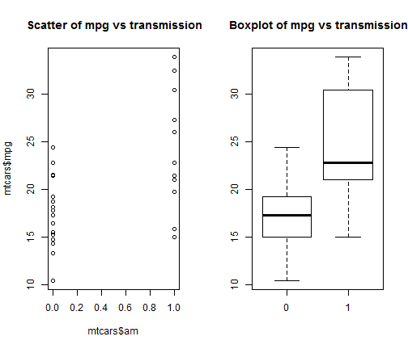

MPG (Mile per gallon) of an automatic versus manual transmission
========================================================
Program description : I used a data set mtcars. In the data set , I will find out between the automatic transmission and the manual transmission which one produces the best mpg.

In the datset mtcars. The outcome variable is mpg ,and am variable is automatic or manual transmission.
The am variable is a caterogical variable where 0 defines as manual transmission, and 1 defines as automatic transmission.


```r
library (knitr)
## http://conjugateprior.org/2012/12/r-markdown-to-other-document-formats/
```

Get the  mean MPG of automatic transmission


```r
## http://www.r-tutor.com/elementary-statistics/inference-about-two-populations/population-mean-between-two-independent-samples
## get the row slice of manual transmission from the mtcars data set 
 L <- mtcars$am == 0
mpgManual <- mtcars[L,]$mpg
meanMPGManual <- mean (mpgManual)
meanMPGManual
```

```
## [1] 17.15
```
Get the mean MPG of manual tranmission


```r
## get the row slice of automatic transmission from the mtcars data set 
L2 <- mtcars$am == 1
mpgAutomatic <- mtcars[L2,]$mpg
meanMPGAutomatic <- mean (mpgAutomatic)
meanMPGAutomatic
```

```
## [1] 24.39
```
Plot of mpg of automatic versus manual where manual transmission  is 0 and automatic transmission is 1


```r
par(mfrow=c(1,2))
plot(mtcars$am,mtcars$mpg, main=" Scatter of mpg vs transmission")
plot(factor(mtcars$am),mtcars$mpg, main=" Boxplot of mpg vs transmission")
```

 

Based on the scatter plot and box plot, manual transmission is performing better than automatic transmission on term of MPG
